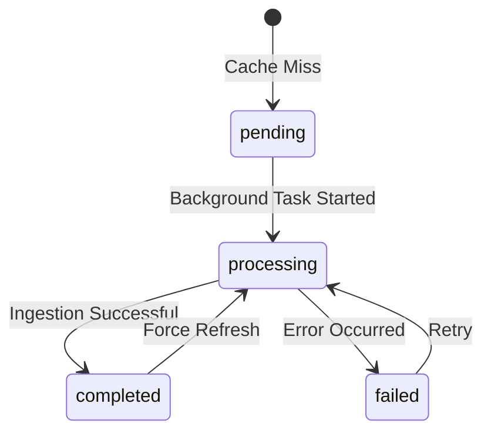

KaggleIngest uses a sophisticated PostgreSQL-based caching layer to minimize redundant Kaggle API calls and provide sub-second response times for frequently accessed competitions and datasets.

## Architecture overview

The caching system implements a **read-through cache pattern** with three-state lifecycle management:

1. **Check cache**: Query PostgreSQL for existing data
2. **Return if ready**: Serve completed results immediately
3. **Process if missing**: Trigger background ingestion and return processing status

<Note>
The cache uses PostgreSQL UNLOGGED tables for 2-3x faster write throughput at the cost of crash recovery. This is acceptable because cached data can be regenerated from Kaggle's API.
</Note>

## UNLOGGED tables explained

### What are UNLOGGED tables?

PostgreSQL UNLOGGED tables skip the Write-Ahead Log (WAL), eliminating the durability overhead that guarantees crash recovery.

**Trade-offs:**

| Feature | LOGGED (default) | UNLOGGED |
|---------|------------------|----------|
| Write speed | Baseline | 2-3x faster |
| Crash recovery | Full recovery | Data lost on crash |
| Replication | Yes | No |
| Best for | Critical data | Regenerable caches |

<Info>
KaggleIngest cache data is **regenerable** from Kaggle's API, making UNLOGGED tables ideal for maximizing ingestion throughput.
</Info>

### Schema definition

The competition cache table is defined in `backend/migrations/001_initial_schema.sql:40`:

```sql
CREATE UNLOGGED TABLE IF NOT EXISTS competition_cache (
    slug VARCHAR(255) PRIMARY KEY,

    -- Basic metadata
    title TEXT,
    description TEXT,
    deadline TIMESTAMP WITH TIME ZONE,
    reward VARCHAR(255),
    category VARCHAR(100),

    -- Full Kaggle API response
    metadata JSONB,

    -- TOON serialized content
    toon_content TEXT,  -- Can be large (1-10MB)
    notebook_count INT DEFAULT 0,

    -- Cache status
    status VARCHAR(20) DEFAULT 'pending' 
        CHECK (status IN ('pending', 'processing', 'completed', 'failed')),
    error_message TEXT,

    -- Timestamps
    fetched_at TIMESTAMP WITH TIME ZONE DEFAULT NOW(),
    updated_at TIMESTAMP WITH TIME ZONE DEFAULT NOW(),

    -- Full-text search vector (auto-generated)
    search_vector tsvector GENERATED ALWAYS AS (
        setweight(to_tsvector('english', COALESCE(title, '')), 'A') ||
        setweight(to_tsvector('english', COALESCE(description, '')), 'B') ||
        setweight(to_tsvector('english', COALESCE(slug, '')), 'C')
    ) STORED
);
```

Key indexes for performance:

```sql
-- Fast status lookups for pending/processing queries
CREATE INDEX idx_competition_status ON competition_cache(status, updated_at);

-- Recent competitions (cache warming)
CREATE INDEX idx_competition_updated ON competition_cache(updated_at DESC);

-- Full-text search (GIN index for tsvector)
CREATE INDEX idx_competition_search ON competition_cache USING GIN(search_vector);

-- Fuzzy search (trigram similarity)
CREATE INDEX idx_competition_title_trgm ON competition_cache USING GIN(title gin_trgm_ops);
```

<Tip>
The `search_vector` column is a **generated column** that automatically indexes title, description, and slug for full-text search. This enables fast competition discovery without manual index maintenance.
</Tip>

## Cache lifecycle states

Every cached resource progresses through states:



### State definitions

| State | Meaning | HTTP Response | TTL |
|-------|---------|---------------|-----|
| **pending** | Not yet started | 202 Accepted | N/A |
| **processing** | Currently ingesting | 202 Accepted | N/A |
| **completed** | Data ready | 200 OK + data | 3 days |
| **failed** | Error occurred | 500 + error message | Retryable |

## Read-through cache pattern

Implementation in `backend/services/notebook_service.py:77`:

```python
async def get_context_read_through(
    self,
    resource_type: str,
    identifier: str,
    background_tasks,
    top_n: int = 10,
    kaggle_creds: dict[str, str] | None = None
) -> dict[str, Any]:
    """
    Read-Through Cache Pattern:
    1. Check DB.
    2. If Status=Completed -> Return Data.
    3. If Status=Processing -> Return "Wait".
    4. If Miss -> Set Status=Processing, Schedule Background Task, Return "Wait".
    """
    from backend.db.session import get_db_pool
    pool = await get_db_pool()

    # 1. Check Cache (SQL INJECTION SAFE)
    if resource_type == "competition":
        query = "SELECT status, metadata, error_message FROM competition_cache WHERE slug = $1"
    else:
        query = "SELECT status, metadata, error_message FROM notebook_cache WHERE identifier = $1"

    row = await pool.fetchrow(query, identifier)

    if row:
        if row['status'] == 'completed':
            return {
                "status": "completed",
                "data": row['metadata']
            }
        elif row['status'] == 'processing':
            return {
                "status": "processing",
                "message": "Resource is being processed. Check back in 30 seconds.",
                "estimated_time": 30
            }
        elif row['status'] == 'failed':
             return {
                 "status": "failed",
                 "message": row['error_message'] or "Unknown error"
             }

    # 2. Miss -> Trigger Ingestion
    if resource_type == "competition":
        insert_query = """
            INSERT INTO competition_cache (slug, status)
            VALUES ($1, 'processing')
            ON CONFLICT (slug) DO NOTHING
        """
    else:
        insert_query = """
            INSERT INTO notebook_cache (identifier, status)
            VALUES ($1, 'processing')
            ON CONFLICT (identifier) DO NOTHING
        """

    await pool.execute(insert_query, identifier)

    # Schedule Background Task
    background_tasks.add_task(
        self.fetch_and_cache_background,
        resource_type,
        identifier,
        top_n,
        kaggle_creds
    )

    return {
        "status": "processing",
        "message": "Ingestion started. Poll this endpoint.",
        "estimated_time": 45
    }
```

## Cache invalidation and TTL

KaggleIngest uses **time-based expiration** configured in `backend/config.py:141`:

```python
# Resource-specific TTLs (Seconds)
TTL_NOTEBOOK = 259200      # 3 days (notebooks change frequently)
TTL_COMPETITION = 259200   # 3 days
TTL_DATASET = 2592000      # 30 days (datasets are more stable)
```

### Automatic cleanup

A periodic cleanup task removes expired entries:

```sql
-- Delete expired cache entries
DELETE FROM competition_cache 
WHERE updated_at < NOW() - INTERVAL '3 days';

DELETE FROM notebook_cache 
WHERE updated_at < NOW() - INTERVAL '3 days';
```

<Info>
The `updated_at` column is automatically maintained via PostgreSQL triggers (see `backend/migrations/001_initial_schema.sql:135`).
</Info>

### Manual invalidation

Force cache refresh using the `force_refresh=true` parameter:

```python
await notebook_service.get_completion_context(
    resource_type="competition",
    identifier="titanic",
    force_refresh=True
)
```

## Generic cache layer

In addition to resource-specific caches, KaggleIngest provides a generic key-value cache in `backend/core/pg_cache.py`:

```python
from backend.core.pg_cache import get_pg_cache

cache = await get_pg_cache()

# Set with custom TTL
await cache.set("key", "value", ttl=3600)  # 1 hour

# Get
value = await cache.get("key")

# Delete
await cache.delete("key")
```

This uses the `cache_entries` table with automatic expiration:

```sql
CREATE TABLE cache_entries (
    cache_key VARCHAR PRIMARY KEY,
    cache_value TEXT,
    cache_type VARCHAR,
    expires_at TIMESTAMP WITH TIME ZONE
);
```

## Connection pooling

The database layer uses `asyncpg` connection pooling for optimal performance:

```python
# backend/core/database.py:30
cls._pool = await asyncpg.create_pool(
    database_url,
    min_size=2,      # Minimum connections
    max_size=10,     # Maximum connections
    command_timeout=60,
    server_settings={
        'application_name': 'kaggleingest',
        'jit': 'off'  # Disable JIT for faster simple queries
    }
)
```

<Tip>
JIT (Just-In-Time compilation) is disabled because KaggleIngest runs many simple queries where JIT overhead exceeds benefits.
</Tip>

## Cache warming strategy

Popular competitions are pre-cached on startup to ensure instant responses:

```python
# backend/config.py:17
POPULAR_COMPETITIONS = [
    "titanic",
    "house-prices-advanced-regression-techniques",
    "digit-recognizer",
    "store-sales-time-series-forecasting",
    "nlp-getting-started"
]
```

The cache warmer service (`backend/services/cache_warmer.py`) runs periodically to refresh these entries before they expire.

## Performance characteristics

| Operation | Latency | Notes |
|-----------|---------|-------|
| Cache hit (completed) | &lt;50ms | Single indexed query |
| Cache hit (processing) | &lt;50ms | Returns status |
| Cache miss (cold start) | 30-60s | Full ingestion |
| Write throughput | 2-3x faster | UNLOGGED tables |
| Connection overhead | ~1ms | Pooled connections |

## Monitoring and observability

Cache metrics are tracked in the `request_logs` table:

```sql
CREATE TABLE request_logs (
    id BIGSERIAL PRIMARY KEY,
    user_id UUID,
    endpoint VARCHAR(255),
    competition_slug VARCHAR(255),
    response_time_ms INT,
    cache_hit BOOLEAN DEFAULT false,
    timestamp TIMESTAMP WITH TIME ZONE DEFAULT NOW()
);
```

Query cache hit rate:

```sql
SELECT 
    COUNT(*) FILTER (WHERE cache_hit = true) * 100.0 / COUNT(*) as hit_rate_percent
FROM request_logs
WHERE timestamp > NOW() - INTERVAL '24 hours';
```

## Best practices

<Accordion title="When to use UNLOGGED tables">
**Use UNLOGGED for:**
- Cache data (regenerable)
- Session data (temporary)
- Analytics staging tables
- High-write temporary workloads

**Avoid UNLOGGED for:**
- User data
- Financial records
- Audit logs
- Anything requiring durability guarantees
</Accordion>

<Accordion title="Cache invalidation strategies">
KaggleIngest uses **TTL-based invalidation** because:

1. Kaggle data changes infrequently (competitions are long-running)
2. Simpler than event-based invalidation
3. Predictable memory usage
4. No need for distributed cache coordination

For real-time requirements, use `force_refresh=true` parameter.
</Accordion>

## Related resources

- Cache implementation: `backend/core/pg_cache.py`
- Read-through pattern: `backend/services/notebook_service.py:77`
- Database schema: `backend/migrations/001_initial_schema.sql`
- Connection pooling: `backend/core/database.py`